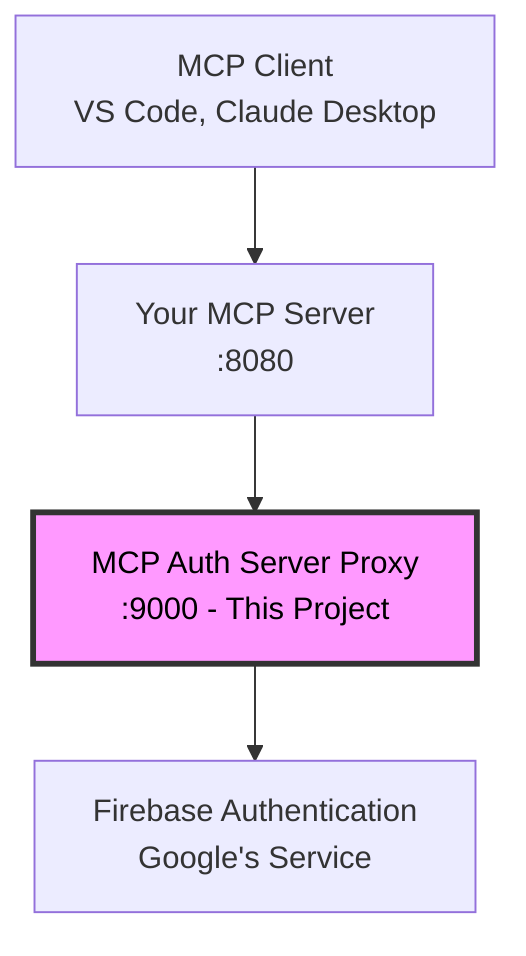

# MCP Auth Server Proxy for Firebase

A ready-to-deploy OAuth2 authentication server that integrates Firebase Authentication with the Model Context Protocol (MCP). This proxy server handles OAuth2 flows and provides secure authentication for MCP servers and clients.

## 🔥 What is this?

This is a **complete OAuth2 authentication server** that:
- 🔐 **Handles OAuth2 flows** for MCP clients (VS Code, Claude Desktop, etc.)
- 🔥 **Uses Firebase Authentication** as the backend identity provider
- 🚀 **Ready to deploy** with Docker or directly with Gradle
- 🎯 **MCP-compatible** with proper discovery endpoints and error handling
- ⚡ **Easy to configure** with just environment variables

## 🏗️ Architecture



- **MCP Clients** → Your MCP Server → **This Auth Proxy** → Firebase
- This proxy handles all OAuth2 complexity so your MCP server stays simple
- Firebase provides the actual user authentication and management

## ✨ Features

### OAuth2 Compliance
- ✅ Authorization Code flow with PKCE
- ✅ Token exchange and refresh
- ✅ Client registration
- ✅ OAuth2 discovery endpoints
- ✅ Proper error handling with WWW-Authenticate headers

### Firebase Integration
- ✅ Firebase ID token validation
- ✅ User profile extraction (email, name, picture)
- ✅ Service account authentication
- ✅ Secure token embedding in JWT claims

### MCP Compatibility
- ✅ `.well-known` discovery endpoints
- ✅ Proper resource metadata responses
- ✅ MCP Inspector compatible
- ✅ CORS enabled for web clients

### Production Ready
- ✅ Docker containerized
- ✅ Environment-based configuration
- ✅ Health check endpoints
- ✅ Comprehensive logging
- ✅ Professional UI templates

## 🚀 Quick Start

### Prerequisites
- Firebase project with Authentication enabled
- Firebase service account key
- Java 17+ (if running locally) or Docker

### 1. Clone and Configure
```bash
git clone https://github.com/muthuishere/mcp-firebase-auth-server.git
cd mcp-firebase-auth-server

# Copy and edit environment file
cp .env.example .env
# Edit .env with your Firebase credentials
```

### 2. Deploy
```bash
# Option 1: Docker (Recommended)
docker-compose up -d

# Option 2: Local development
./gradlew bootRun
```

### 3. Verify
```bash
# Check OAuth2 discovery
curl http://localhost:9000/.well-known/oauth-authorization-server

# Visit the auth server
open http://localhost:9000
```

🎉 **That's it!** Your OAuth2 auth server is running on port 9000.

## 🛠️ Configuration

### Environment Variables

| Variable | Description | Example |
|----------|-------------|---------|
| `AUTH_SERVER_PORT` | Port for the auth server | `9000` |
| `MCP_AUTH_SERVER_URL` | Public URL of this server | `http://localhost:9000` |
| `FIREBASE_PROJECT_ID` | Your Firebase project ID | `my-project-123` |
| `FIREBASE_API_KEY` | Firebase web API key | `AIzaSy...` |
| `FIREBASE_SERVICE_ACCOUNT_KEY` | Firebase service account JSON | `{"type":"service_account",...}` |

### Firebase Setup
1. Create a Firebase project at [Firebase Console](https://console.firebase.google.com)
2. Enable Authentication with desired providers (Google, Email/Password, etc.)
3. Generate a service account key from Project Settings → Service Accounts
4. Get your web API key from Project Settings → General

## 📖 Available Endpoints

### OAuth2 Endpoints
- `GET /.well-known/oauth-authorization-server` - OAuth2 server metadata
- `GET /.well-known/openid-configuration` - OpenID Connect discovery
- `GET /oauth2/authorize` - Authorization endpoint
- `POST /oauth2/token` - Token exchange endpoint
- `POST /oauth2/refresh` - Token refresh endpoint
- `POST /oauth2/register` - Dynamic client registration
- `POST /oauth2/consent` - User consent handling

### Authentication Flow
- `GET /` - Login page
- `GET /login` - Alternative login endpoint
- `POST /api/auth/session` - Session authentication
- `GET /api/config` - Client configuration

### Health & Monitoring
- `GET /api/health` - Simple health check
- `GET /oauth2/health` - Detailed health status

## 🔗 Integrate with Your MCP Server

This auth server is designed to work with your custom MCP server. Your MCP server needs to implement specific endpoints to integrate with this proxy.

### 📋 **[Complete Integration Guide →](mcp-server-setup.md)**

The integration guide covers:
- Required REST API endpoints for your MCP server
- JWT token validation logic
- Authentication error handling
- Local development setup
- Testing with MCP Inspector

## 🎨 User Interface

The auth server includes professional-looking web templates with:
- 🔥 Firebase branding with fire icon
- 📱 Responsive design
- 🎯 Clear OAuth2 flow guidance
- 👤 Personal attribution and links
- ❌ Proper error handling pages

## 🐳 Deployment Options

### Docker Compose (Recommended)
```yaml
version: '3.8'
services:
  mcp-auth-server:
    image: muthuishere/mcp-firebase-auth-server
    ports:
      - "9000:9000"
    env_file:
      - .env
```

### Docker Run
```bash
docker run -p 9000:9000 --env-file .env muthuishere/mcp-firebase-auth-server
```

### Cloud Deployment
Deploy to any platform that supports Docker:
- AWS ECS/Fargate
- Google Cloud Run
- Azure Container Instances
- DigitalOcean App Platform
- Railway, Render, Heroku

## 🧪 Testing

### Manual Testing
```bash
# Test OAuth2 discovery
curl http://localhost:9000/.well-known/oauth-authorization-server

# Test authorization (will redirect to login)
open "http://localhost:9000/oauth2/authorize?response_type=code&client_id=test&redirect_uri=http://localhost:3000/callback"
```

### With MCP Inspector
Use the MCP Inspector to test the complete OAuth2 flow with a visual interface.

## 🤝 Contributing

Contributions are welcome! This project helps the MCP ecosystem by providing a standardized authentication solution.

### Development Setup
```bash
git clone https://github.com/muthuishere/mcp-firebase-auth-server.git
cd mcp-firebase-auth-server
./gradlew bootRun
```

### Project Structure
- `src/main/java/tools/muthuishere/mcpauthserver/` - Main application code
- `src/main/resources/templates/` - HTML templates for auth flow
- `referencemcpserver/` - Reference implementation for MCP server integration
- `mcp-server-setup.md` - Complete integration guide

## 📝 License

MIT License - feel free to use this in your projects!

## 👨‍💻 Author

**Muthukumaran Navaneethakrishnan**
- GitHub: [@muthuishere](https://github.com/muthuishere)
- LinkedIn: [muthuishere](https://www.linkedin.com/in/muthuishere/)

## 🆘 Support

- 📖 **Integration Help**: See [MCP Server Setup Guide](mcp-server-setup.md)
- 🐛 **Issues**: [GitHub Issues](https://github.com/muthuishere/mcp-firebase-auth-server/issues)
- 💬 **Questions**: Contact [@muthuishere](https://github.com/muthuishere)

---
