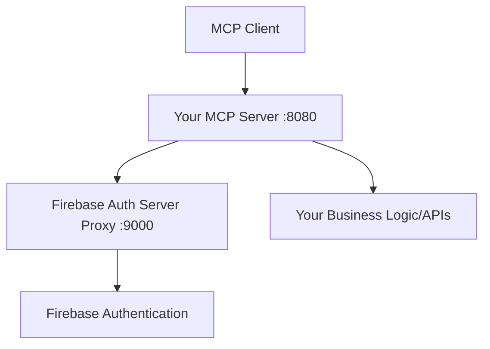

# MCP Server Integration Guide
## Setting up an MCP Server with Firebase Auth Server Proxy

This guide shows how to create your own MCP server that integrates with the **MCP Auth Server Proxy for Firebase** for OAuth2 authentication.

## Architecture Overview



- **MCP Client**: VS Code, Claude Desktop, or other MCP clients  
- **Your MCP Server**: Your custom application server (this guide) - port 8080
- **Firebase Auth Server Proxy**: Ready-to-use authentication server (this repo) - port 9000
- **Firebase Authentication**: Google's Firebase Auth service

## Part 1: Deploy the Firebase Auth Server Proxy (Ready to Use!)

### Step 1: Clone This Repository
```bash
git clone https://github.com/muthuishere/mcp-firebase-auth-server.git
cd mcp-firebase-auth-server
```

### Step 2: Configure Your Environment
Copy the example environment file and update with your Firebase credentials:
```bash
cp .env.example .env
```

Edit `.env` with your Firebase project details:
```env
# Application Configuration
AUTH_SERVER_PORT=9000
MCP_AUTH_SERVER_URL=http://localhost:9000  # or your deployed URL

# Firebase Configuration  
FIREBASE_PROJECT_ID=your-actual-firebase-project-id
FIREBASE_API_KEY=your-actual-firebase-api-key
FIREBASE_SERVICE_ACCOUNT_KEY={"type":"service_account",...} # your actual service account JSON
```

### Step 3: Deploy the Auth Server Proxy
```bash
# Using Docker Compose (recommended)
docker-compose up -d

# Or using Docker directly
docker build -t mcp-firebase-auth-server .
docker run -p 9000:9000 --env-file .env mcp-firebase-auth-server

# Or using Gradle (for development)
./gradlew bootRun
```

✅ **That's it! Your Firebase Auth Server Proxy is now running on port 9000**

The proxy provides all the OAuth2 endpoints your MCP clients need:
- `http://localhost:9000/.well-known/oauth-authorization-server` - OAuth2 discovery
- `http://localhost:9000/oauth2/authorize` - Authorization endpoint
- `http://localhost:9000/oauth2/token` - Token exchange endpoint
- `http://localhost:9000/oauth2/refresh` - Token refresh endpoint
- `http://localhost:9000/oauth2/register` - Client registration

## Part 2: Create Your Custom MCP Server

Now you need to create your own MCP server (in any language) that uses the Firebase Auth Server Proxy for authentication.

### Language Support
- **Java/Spring Boot**: See reference implementation in `referencemcpserver/` folder
- **Any other language**: Follow the REST API specification below
- **Need help with implementation?**: Contact [@muthuishere](https://github.com/muthuishere) for specific language examples

## Your MCP Server Requirements

Your MCP server (regardless of language) must implement these components:

### 1. Required OAuth2 Discovery Endpoints
Your MCP server must expose these REST endpoints so MCP clients can discover the authentication flow:

```http
GET /.well-known/oauth-protected-resource
# Returns metadata about your protected resource

GET /.well-known/oauth-authorization-server  
# Points to the Firebase Auth Server Proxy

GET /login/oauth
# Redirects to the Firebase Auth Server Proxy for authentication
```

### 2. JWT Token Validation
Your server needs to:
- Extract JWT tokens from `Authorization: Bearer <token>` headers
- Parse JWT tokens to extract the `firebase_token` claim
- Validate Firebase tokens using Firebase Admin SDK or Firebase REST API

### 3. Authentication Error Handling  
Return proper `WWW-Authenticate` headers when tokens are missing/invalid.

## Step 1: MCP Server Environment Configuration

Create your MCP server project (in any language) and configure these environment variables:

```env
# Your MCP Server Configuration
MCP_SERVER_PORT=8080
MCP_RESOURCE_SERVER_URL=http://localhost:8080

# Firebase Auth Server Proxy Configuration (points to the deployed proxy)
MCP_AUTH_SERVER_URL=http://localhost:9000  # or your deployed proxy URL

# Firebase Configuration (same as proxy - needed for JWT validation)
FIREBASE_PROJECT_ID=your-firebase-project-id
FIREBASE_API_KEY=your-firebase-api-key
FIREBASE_SERVICE_ACCOUNT_KEY={"type":"service_account",...} # same as proxy
```

## Step 2: Required REST API Endpoints

Your MCP server must implement these specific REST endpoints:

### 2.1 OAuth2 Resource Metadata Endpoint
```http
GET /.well-known/oauth-protected-resource
Content-Type: application/json
```

**Response Example:**
```json
{
  "resource_name": "Your MCP Server Name",
  "resource": "http://localhost:8080",
  "authorization_servers": ["http://localhost:9000"],
  "bearer_methods_supported": ["header"],
  "scopes_supported": ["read:email"]
}
```

### 2.2 OAuth2 Authorization Server Metadata Endpoint
```http
GET /.well-known/oauth-authorization-server
Content-Type: application/json
```

**Response Example:**
```json
{
  "issuer": "http://localhost:9000",
  "authorization_endpoint": "http://localhost:9000/oauth2/authorize",
  "token_endpoint": "http://localhost:9000/oauth2/token",
  "refresh_endpoint": "http://localhost:9000/oauth2/refresh",
  "response_types_supported": ["code"],
  "grant_types_supported": ["authorization_code", "refresh_token"],
  "scopes_supported": ["read:email"],
  "token_endpoint_auth_methods_supported": ["client_secret_basic", "client_secret_post", "none"],
  "registration_endpoint": "http://localhost:9000/oauth2/register"
}
```

### 2.3 OAuth Login Redirect Endpoint
```http
GET /login/oauth
Content-Type: application/json
Location: http://localhost:9000/login/oauth
Status: 302
```

**Response Example:**
```json
{
  "authorization_url": "http://localhost:9000/oauth2/authorize",
  "token_url": "http://localhost:9000/oauth2/token",
  "refresh_url": "http://localhost:9000/oauth2/refresh",
  "redirect_url": "http://localhost:9000/login/oauth"
}
```

## Step 3: JWT Token Validation Logic

Your server must validate JWT tokens that contain Firebase tokens. Here's the logic flow:

### 3.1 Extract JWT Token from Request
```http
Authorization: Bearer <JWT_TOKEN>
```
Extract the token after "Bearer " prefix.

### 3.2 Parse JWT and Extract Firebase Token
1. Parse the JWT token (without signature verification)
2. Extract the `firebase_token` claim from JWT payload
3. If no `firebase_token` claim exists, use the original token as Firebase token

**JWT Payload Structure:**
```json
{
  "sub": "user-id",
  "firebase_token": "eyJhbGciOiJSUzI1NiIsInR5cCI6IkpXVCJ9...",
  "iat": 1699123456,
  "exp": 1699127056
}
```

### 3.3 Validate Firebase Token
1. Use Firebase Admin SDK or Firebase REST API to verify the Firebase token
2. Extract user information from validated token
3. Return user context for protected endpoints

**Expected User Data:**
```json
{
  "uid": "firebase-user-id",
  "email": "user@example.com", 
  "email_verified": true,
  "name": "User Name",
  "picture": "https://profile-image-url"
}
```

## Step 4: Authentication Error Handling

When JWT tokens are missing or invalid, your server must return proper error responses with `WWW-Authenticate` headers.

### 4.1 Missing Token Error (401 Unauthorized)
```http
Status: 401 Unauthorized
Content-Type: application/json
WWW-Authenticate: Bearer error="invalid_request", error_description="No access token was provided in this request", resource_metadata="http://localhost:8080/.well-known/oauth-protected-resource/mcp/"
```

**Response Body:**
```json
{
  "error": "invalid_request",
  "error_description": "No access token was provided in this request",
  "resource_metadata": "http://localhost:8080/.well-known/oauth-protected-resource/mcp/"
}
```

### 4.2 Invalid Token Error (401 Unauthorized)  
```http
Status: 401 Unauthorized
Content-Type: application/json
WWW-Authenticate: Bearer error="invalid_token", error_description="The access token provided is expired, revoked, malformed, or invalid", resource_metadata="http://localhost:8080/.well-known/oauth-protected-resource/mcp/"
```

**Response Body:**
```json
{
  "error": "invalid_token", 
  "error_description": "The access token provided is expired, revoked, malformed, or invalid",
  "resource_metadata": "http://localhost:8080/.well-known/oauth-protected-resource/mcp/"
}
```

### 4.3 Error Response Requirements
Your server must return these exact HTTP headers and JSON structure for MCP clients to properly handle authentication errors.

## Step 5: Middleware/Security Configuration

Your server needs to protect all endpoints except the public OAuth discovery endpoints:

### 5.1 Public Endpoints (No Authentication Required)
- `GET /` - Health check
- `GET /api/health` - Health check  
- `GET /.well-known/**` - OAuth discovery endpoints
- `GET /login/oauth` - OAuth redirect endpoint

### 5.2 Protected Endpoints (Authentication Required)
- All other endpoints require valid JWT tokens

### 5.3 CORS Configuration
Enable CORS for MCP clients:
```http
Access-Control-Allow-Origin: *
Access-Control-Allow-Methods: GET, POST, PUT, DELETE, OPTIONS
Access-Control-Allow-Headers: *
Access-Control-Allow-Credentials: true
```

### 5.4 Authentication Flow Summary
1. **Extract Token**: Get JWT from `Authorization: Bearer <token>` header
2. **Parse JWT**: Extract `firebase_token` claim from JWT payload  
3. **Validate Firebase Token**: Use Firebase Admin SDK/API to verify
4. **Handle Errors**: Return proper WWW-Authenticate headers for auth failures
5. **Protect Endpoints**: Apply authentication to all non-public endpoints

## Step 6: Your Business Logic APIs

Now implement your actual MCP server endpoints! These are protected and require authentication:

### Example Protected Endpoints
```http
GET /api/todos          # Get user's todos (requires auth)
POST /api/todos         # Create new todo (requires auth)  
GET /api/profile        # Get user profile (requires auth)
GET /api/data           # Get user-specific data (requires auth)
```

### Authentication Context
After successful token validation, your endpoints will have access to user information:
```json
{
  "uid": "firebase-user-id",
  "email": "user@example.com",
  "email_verified": true,
  "name": "User Name"
}
```

Use this user context to implement user-specific business logic in your protected endpoints.

## Step 7: Local Development Setup

1. **Start the Firebase Auth Server Proxy (Port 9000)**:
   ```bash
   cd /path/to/cloned/mcp-firebase-auth-server
   ./gradlew bootRun
   ```

2. **Start Your MCP Server (Port 8080)**:
   Configure your server to use `MCP_AUTH_SERVER_URL=http://localhost:9000` and run your application.

3. **Test the Integration**:
   ```bash
   # Test OAuth discovery endpoints
   curl http://localhost:8080/.well-known/oauth-protected-resource
   curl http://localhost:8080/.well-known/oauth-authorization-server
   
   # Test protected endpoint (should return 401 with WWW-Authenticate header)
   curl -v http://localhost:8080/api/protected
   ```

4. **Test with MCP Inspector**:
   Use the MCP Inspector at `http://localhost:8080` to test the complete OAuth2 authentication flow with guided UI.

## Step 10: Testing the Integration

1. **Start both servers:**


2. **Test the metadata endpoints:**
   ```bash
   # Test resource metadata
   curl http://localhost:8080/.well-known/oauth-protected-resource/mcp/
   
   # Test auth server metadata
   curl http://localhost:8080/.well-known/oauth-authorization-server
   ```

3. **Test authentication flow:**
   ```bash
   # Try accessing a protected endpoint (should return 401 with WWW-Authenticate header)
   curl -v http://localhost:8080/mcp
   ```

4. **Configure MCP client:** Use `http://localhost:8080/mcp` as your MCP server URL in VS Code or Claude Desktop. dont add final slash

## Key Integration Points

1. **OAuth Discovery**: Your MCP server exposes the required `.well-known` endpoints
2. **JWT Validation**: Firebase tokens are validated using the Firebase Admin SDK
3. **Error Handling**: Proper WWW-Authenticate headers guide clients to the auth server
4. **Token Extraction**: JWT tokens containing Firebase tokens are properly decoded
